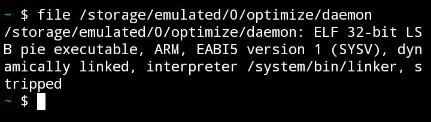

# Tweak Performance+ Without root

useful tweaks to improve the performance of your android, no root, just a terminal with adb connection

## Feature

* optimize CPU, GPU, FPS, & Signal
* Vulkan render with layer extension fast render VK
* Change Light theme for performance
* Kill-all activity
* Multi-depth composition
* Improve Idle drain
* Improve touch ( 250 press timeout )
* Fstrim every 1 Day
* Fast Charging
* Enable Fixed-performance mode
* Disable Thermal service override
* Disable AA
* Game Driver Android 11 & 12+
* and more...

## How to install?

in your terminal, connect with adb first.
( after putting the files into /sdcard/optimize/daemon )

```bash
rm -rf /data/local/tmp/* && cp /sdcard/optimize/daemon /data/local/tmp && cd /data/local/tmp && chmod a+x /data/local/tmp/daemon && ./daemon
```

### Game Driver For Android 11 & 12+ Guide

in /sdcard/optimize/game_driver.txt
put the name of the game package that you want to activate as a game driver, if two or more add a comma ( , ) for my example, i give 2 examples:

E.g 1 : com.nexon.bluearchive

E.g 2 : com.nexon.bluearchive,com.supercell.clashofclans,com

## Preview

<p align="center">
  
</p>

### Information 
For Now support architecture 32 bit, because I'm encrypt with 32 bit, can't swith 32 bit to 64 bit bruh, but can switch 64 bit to 32 bit, latter new update I'm create for 64 bit & 32 bit :)
if you have solution chat me in [Telegram](t.me/xchillds)
<p align="center">
  
</p>
